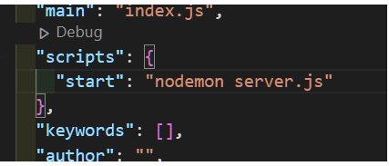

## First Express JS Project

### 👀️ Commands on bash

* `npm init`
* `npm i express ejs mongoose`
* `npm i -D nodemon`
* `npm i shortid`

---

👍 **Create a .gitignore file inside which write**

> node_modules

## Changes inside `package.json`

* Inside the `scripts` object delete the key : value pair and add this --`"start": "nodemon server.js"`

